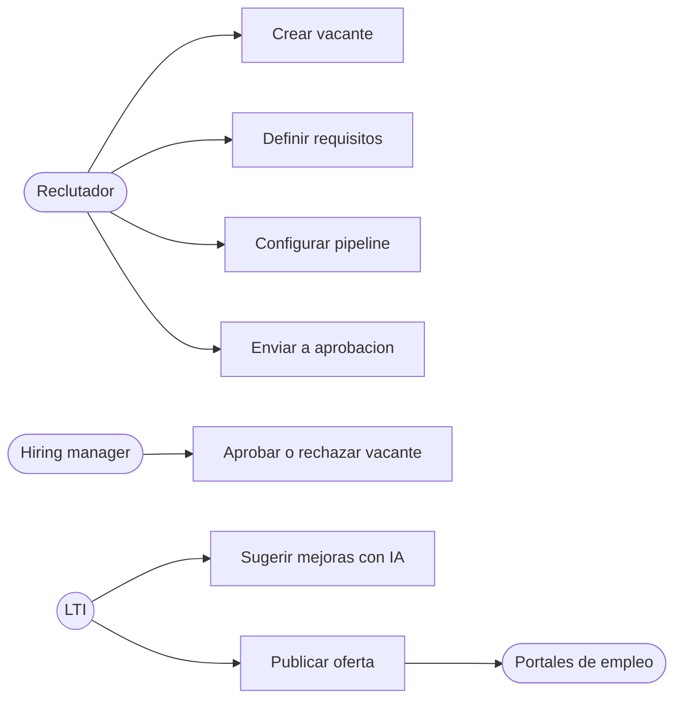
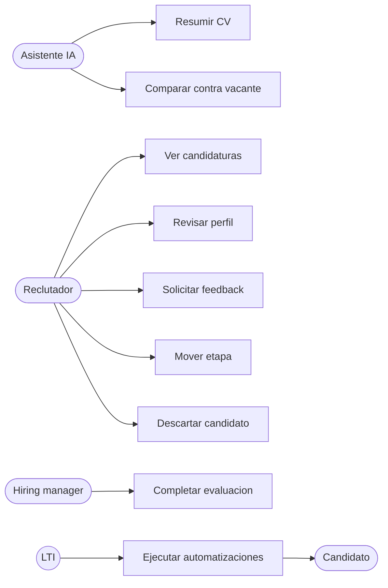
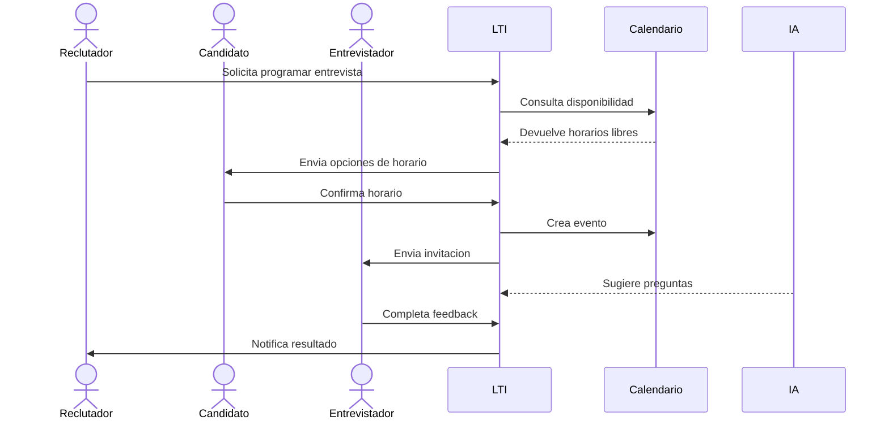
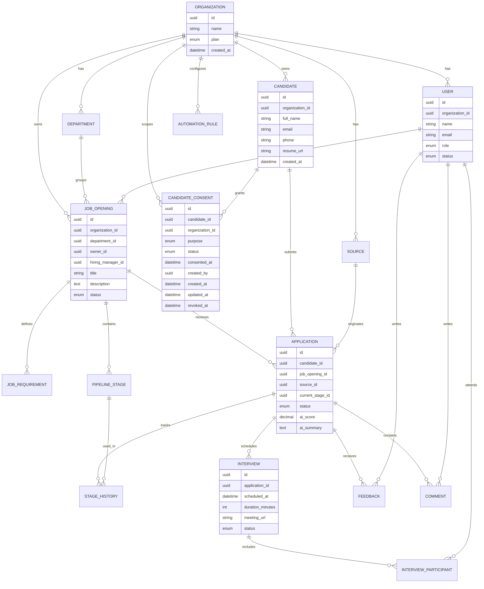
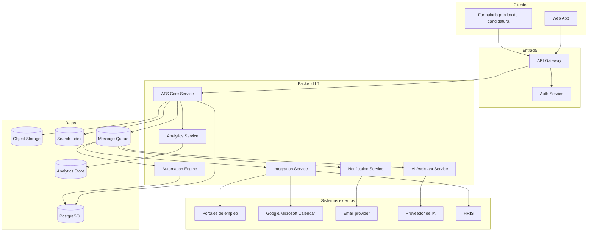
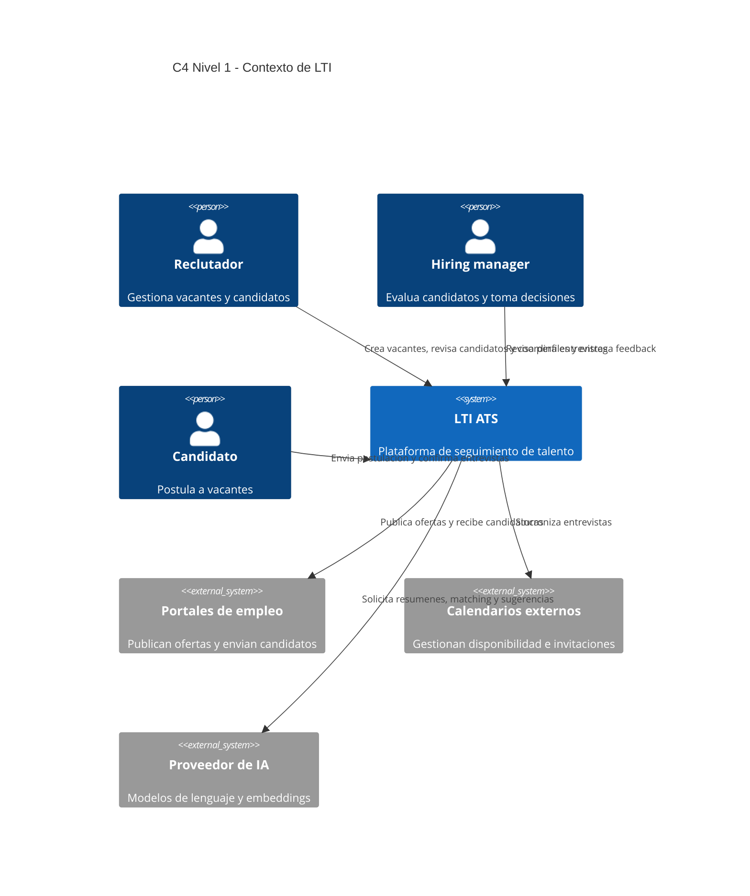
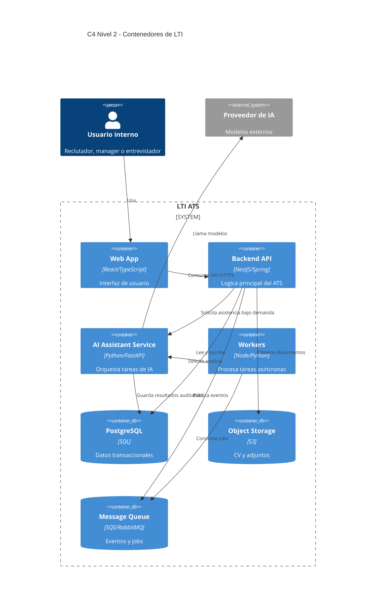
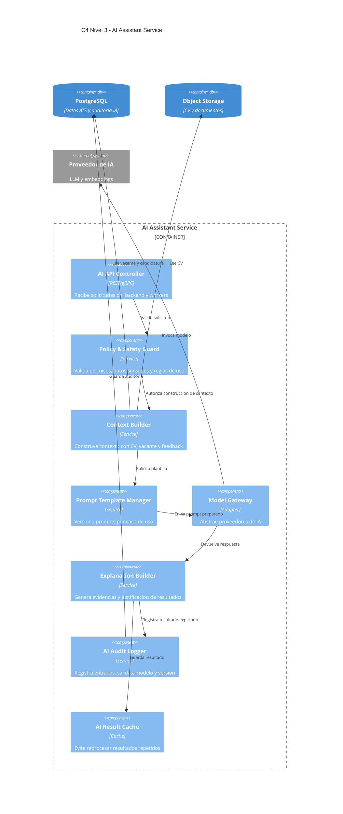

# LTI - Sistema de Seguimiento de Talento

## 1. Descripcion breve del software

LTI es un ATS moderno orientado a equipos de Recursos Humanos, reclutadores externos y hiring managers que necesitan gestionar procesos de seleccion de forma mas rapida, colaborativa y medible.

La primera version del sistema se centra en resolver el ciclo principal de reclutamiento: crear vacantes, publicar ofertas, recibir candidaturas, evaluar talento, coordinar entrevistas, colaborar en tiempo real y tomar decisiones apoyadas por automatizaciones e inteligencia artificial.

### Valor anadido

LTI busca diferenciarse de los ATS tradicionales combinando tres capacidades:

- Colaboracion en tiempo real entre reclutadores, managers y entrevistadores.
- Automatizacion de tareas repetitivas como filtrado inicial, recordatorios, cambios de etapa, comunicaciones y generacion de resumentes.
- Asistencia de IA para mejorar la calidad y velocidad de decisiones, sin reemplazar el criterio humano.

### Ventajas competitivas

- Experiencia centralizada: vacantes, candidatos, entrevistas, feedback, comunicaciones y metricas en un unico flujo.
- IA explicable: recomendaciones acompanadas de criterios, evidencias y posibles sesgos a revisar.
- Colaboracion contextual: comentarios, menciones, feedback y decisiones quedan ligados al candidato, vacante o entrevista correspondiente.
- Automatizaciones configurables: cada empresa puede definir reglas segun sus procesos.
- Analitica accionable: indicadores de tiempo de contratacion, embudo, fuentes de talento, diversidad, carga de trabajo y cuellos de botella.
- Diseno API-first: facilita integraciones con portales de empleo, calendarios, correo, herramientas HRIS y plataformas de assessment.

## 2. Funciones principales

### Gestion de vacantes

Permite crear, aprobar, publicar y cerrar vacantes. Cada vacante incluye descripcion, requisitos, salario, modalidad, ubicacion, responsable, etapas del proceso y criterios de evaluacion.

### Captacion y gestion de candidatos

Centraliza perfiles de candidatos provenientes de formularios, portales de empleo, referidos, carga manual e integraciones externas. Cada perfil mantiene CV, datos de contacto, historial de postulaciones, notas, etiquetas y consentimientos.

### Pipeline de seleccion

Cada candidatura avanza por etapas configurables: recibido, preseleccion, entrevista inicial, entrevista tecnica, entrevista final, oferta, contratado o descartado. El sistema registra cambios de etapa, responsables y motivos.

### Colaboracion y feedback

Reclutadores y managers pueden comentar perfiles, mencionar usuarios, completar scorecards, dejar evaluaciones estructuradas y comparar candidatos dentro de una vacante.

### Automatizaciones

El sistema permite crear reglas como:

- Enviar correo automatico al recibir candidatura.
- Mover candidatos a preseleccion si cumplen criterios minimos.
- Solicitar feedback al entrevistador despues de una entrevista.
- Alertar al manager si una vacante lleva varios dias sin avance.
- Enviar comunicacion de descarte con plantilla aprobada.

### Asistencia de IA

La IA ayuda a:

- Resumir CV y destacar experiencia relevante.
- Comparar candidatos contra requisitos de la vacante.
- Sugerir preguntas de entrevista.
- Detectar inconsistencias o informacion faltante.
- Redactar comunicaciones.
- Priorizar candidatos con explicacion y revision humana obligatoria.

### Entrevistas y calendario

Permite proponer horarios, sincronizar calendarios, enviar invitaciones, registrar entrevistas y recoger feedback estructurado.

### Analitica y reportes

Incluye dashboards para visualizar fuentes de candidatos, tiempos por etapa, conversiones del embudo, rendimiento de reclutadores, vacantes abiertas, candidatos bloqueados y calidad de contratacion.

## 3. Lean Canvas

```mermaid
flowchart TB
    LC["Lean Canvas - LTI ATS"]

    P["Problema<br/>Procesos lentos y dispersos<br/>Poca colaboracion con managers<br/>Tareas repetitivas en HR<br/>Datos incompletos para decidir"]
    S["Segmentos de clientes<br/>Startups en crecimiento<br/>Pymes con alto volumen de seleccion<br/>Equipos HR internos<br/>Agencias de reclutamiento"]
    UVP["Propuesta de valor unica<br/>ATS colaborativo con IA y automatizaciones para contratar mejor y mas rapido"]
    SOL["Solucion<br/>Pipeline configurable<br/>IA para resumen y matching<br/>Automatizaciones<br/>Feedback estructurado<br/>Dashboards"]
    CH["Canales<br/>Venta directa B2B<br/>Alianzas HR tech<br/>Marketplaces SaaS<br/>Contenido especializado<br/>Referidos"]
    REV["Fuentes de ingresos<br/>Suscripcion por empresa<br/>Planes por numero de usuarios<br/>Add-on de IA<br/>Servicios de implementacion"]
    COST["Estructura de costes<br/>Infraestructura cloud<br/>Modelos de IA<br/>Desarrollo de producto<br/>Soporte y onboarding<br/>Ventas y marketing"]
    MET["Metricas clave<br/>Time to hire<br/>Conversion por etapa<br/>Vacantes activas<br/>Uso de automatizaciones<br/>Feedback completado<br/>Retencion mensual"]
    ADV["Ventaja diferencial<br/>IA explicable<br/>Colaboracion en tiempo real<br/>API-first<br/>Automatizaciones configurables<br/>Analitica accionable"]

    LC --> P
    LC --> S
    LC --> UVP
    LC --> SOL
    LC --> CH
    LC --> REV
    LC --> COST
    LC --> MET
    LC --> ADV
```

## 4. Casos de uso principales

### Caso de uso 1: Crear y publicar una vacante

**Actor principal:** Reclutador  
**Actores secundarios:** Hiring manager, sistema de aprobaciones, portales de empleo  
**Objetivo:** Crear una vacante completa, obtener aprobacion y publicarla en canales seleccionados.

**Precondiciones:**

- El reclutador esta autenticado.
- La empresa tiene al menos un flujo de seleccion configurado.
- Existen permisos para crear vacantes.

**Flujo principal:**

1. El reclutador crea una nueva vacante.
2. Completa datos basicos: titulo, area, ubicacion, modalidad, salario y descripcion.
3. Define requisitos obligatorios y deseables.
4. Selecciona etapas del pipeline y responsables.
5. El sistema sugiere mejoras a la descripcion y posibles criterios de evaluacion.
6. El reclutador envia la vacante a aprobacion.
7. El hiring manager revisa y aprueba.
8. El sistema publica la vacante en los canales seleccionados.
9. La vacante queda activa y lista para recibir candidatos.

**Flujos alternativos:**

- Si el manager rechaza la vacante, el sistema devuelve comentarios al reclutador.
- Si un portal externo falla, el sistema registra el error y permite reintentar.

### Caso de uso 2: Evaluar y avanzar candidatos en el pipeline

**Actor principal:** Reclutador  
**Actores secundarios:** Hiring manager, IA, candidato  
**Objetivo:** Revisar candidatos, priorizarlos, registrar evaluaciones y moverlos entre etapas.

**Precondiciones:**

- Existe una vacante activa.
- Hay candidaturas recibidas.
- El reclutador tiene permisos sobre la vacante.

**Flujo principal:**

1. El reclutador abre la lista de candidaturas de una vacante.
2. El sistema muestra candidatos ordenados por estado, fecha, fuente y puntuacion sugerida.
3. La IA resume el CV y compara el perfil con los requisitos.
4. El reclutador revisa la explicacion de la recomendacion.
5. El reclutador abre el perfil del candidato.
6. Agrega notas o solicita opinion al hiring manager.
7. El manager revisa el perfil y deja feedback.
8. El reclutador mueve al candidato a la siguiente etapa o lo descarta.
9. El sistema registra el cambio y ejecuta automatizaciones asociadas.

**Flujos alternativos:**

- Si falta informacion, el reclutador solicita datos adicionales al candidato.
- Si la IA detecta baja confianza, el candidato se muestra sin recomendacion automatica.

### Caso de uso 3: Coordinar entrevista y registrar feedback

**Actor principal:** Reclutador  
**Actores secundarios:** Candidato, entrevistador, calendario externo, sistema de notificaciones  
**Objetivo:** Programar una entrevista, sincronizar calendario y recopilar feedback estructurado.

**Precondiciones:**

- El candidato esta en una etapa que requiere entrevista.
- Hay entrevistadores asignados.
- La empresa tiene configurada integracion de calendario o disponibilidad manual.

**Flujo principal:**

1. El reclutador selecciona al candidato y elige "Programar entrevista".
2. El sistema consulta disponibilidad de entrevistadores.
3. El reclutador propone horarios o envia enlace de seleccion al candidato.
4. El candidato confirma un horario.
5. El sistema crea el evento en calendario y envia invitaciones.
6. Antes de la entrevista, la IA sugiere preguntas basadas en la vacante y el CV.
7. Tras la entrevista, el sistema solicita feedback al entrevistador.
8. El entrevistador completa scorecard y recomendacion.
9. El sistema actualiza el estado del candidato y notifica al reclutador.

**Flujos alternativos:**

- Si el candidato solicita reprogramar, el sistema vuelve a ofrecer horarios.
- Si el entrevistador no completa feedback, se envia recordatorio automatico.

## 5. Modelo de datos

### Entidades y atributos

| Entidad | Atributo | Tipo | Descripcion |
|---|---|---|---|
| Organization | id | UUID | Identificador unico |
| Organization | name | String | Nombre de la empresa |
| Organization | plan | Enum | Plan contratado |
| Organization | created_at | DateTime | Fecha de alta |
| User | id | UUID | Identificador unico |
| User | organization_id | UUID | Empresa a la que pertenece |
| User | name | String | Nombre completo |
| User | email | String | Correo corporativo |
| User | role | Enum | Admin, recruiter, manager, interviewer |
| User | status | Enum | Active, invited, disabled |
| Department | id | UUID | Identificador unico |
| Department | organization_id | UUID | Empresa propietaria |
| Department | name | String | Nombre del departamento |
| JobOpening | id | UUID | Identificador unico |
| JobOpening | organization_id | UUID | Empresa propietaria |
| JobOpening | department_id | UUID | Departamento asociado |
| JobOpening | owner_id | UUID | Reclutador responsable |
| JobOpening | hiring_manager_id | UUID | Manager responsable |
| JobOpening | title | String | Titulo de la vacante |
| JobOpening | description | Text | Descripcion de la vacante |
| JobOpening | location | String | Ubicacion |
| JobOpening | work_mode | Enum | Remote, hybrid, onsite |
| JobOpening | salary_min | Decimal | Salario minimo |
| JobOpening | salary_max | Decimal | Salario maximo |
| JobOpening | status | Enum | Draft, pending_approval, open, paused, closed |
| JobRequirement | id | UUID | Identificador unico |
| JobRequirement | job_opening_id | UUID | Vacante asociada |
| JobRequirement | name | String | Nombre del requisito |
| JobRequirement | type | Enum | Must_have, nice_to_have |
| JobRequirement | weight | Integer | Peso de evaluacion |
| Candidate | id | UUID | Identificador unico |
| Candidate | organization_id | UUID | Empresa propietaria del perfil de candidato |
| Candidate | full_name | String | Nombre completo |
| Candidate | email | String | Correo |
| Candidate | phone | String | Telefono |
| Candidate | location | String | Ubicacion |
| Candidate | resume_url | String | URL del CV |
| Candidate | created_at | DateTime | Fecha de creacion |
| CandidateConsent | id | UUID | Identificador unico |
| CandidateConsent | candidate_id | UUID | Candidato asociado |
| CandidateConsent | organization_id | UUID | Empresa a la que aplica el consentimiento |
| CandidateConsent | purpose | Enum | Recruiting, talent_pool, analytics, communications |
| CandidateConsent | status | Enum | Pending, granted, revoked |
| CandidateConsent | consented_at | DateTime | Fecha de aceptacion |
| CandidateConsent | created_by | UUID | Usuario que registro el consentimiento |
| CandidateConsent | created_at | DateTime | Fecha de creacion |
| CandidateConsent | updated_at | DateTime | Fecha de ultima actualizacion |
| CandidateConsent | revoked_at | DateTime | Fecha de revocacion |
| Application | id | UUID | Identificador unico |
| Application | candidate_id | UUID | Candidato asociado |
| Application | job_opening_id | UUID | Vacante asociada |
| Application | source_id | UUID | Fuente de origen |
| Application | current_stage_id | UUID | Etapa actual |
| Application | status | Enum | Active, hired, rejected, withdrawn |
| Application | ai_score | Decimal | Puntuacion sugerida por IA |
| Application | ai_summary | Text | Resumen generado por IA |
| PipelineStage | id | UUID | Identificador unico |
| PipelineStage | job_opening_id | UUID | Vacante asociada |
| PipelineStage | name | String | Nombre de etapa |
| PipelineStage | position | Integer | Orden de la etapa |
| PipelineStage | stage_type | Enum | Screening, interview, offer, final |
| StageHistory | id | UUID | Identificador unico |
| StageHistory | application_id | UUID | Candidatura asociada |
| StageHistory | from_stage_id | UUID | Etapa anterior |
| StageHistory | to_stage_id | UUID | Etapa nueva |
| StageHistory | changed_by | UUID | Usuario que hizo el cambio |
| StageHistory | changed_at | DateTime | Fecha del cambio |
| Interview | id | UUID | Identificador unico |
| Interview | application_id | UUID | Candidatura asociada |
| Interview | stage_id | UUID | Etapa asociada |
| Interview | scheduled_at | DateTime | Fecha y hora |
| Interview | duration_minutes | Integer | Duracion |
| Interview | meeting_url | String | Enlace de reunion |
| Interview | status | Enum | Scheduled, completed, cancelled |
| InterviewParticipant | id | UUID | Identificador unico |
| InterviewParticipant | interview_id | UUID | Entrevista asociada |
| InterviewParticipant | user_id | UUID | Entrevistador |
| Feedback | id | UUID | Identificador unico |
| Feedback | application_id | UUID | Candidatura asociada |
| Feedback | interview_id | UUID | Entrevista asociada |
| Feedback | author_id | UUID | Usuario autor |
| Feedback | score | Integer | Puntuacion |
| Feedback | recommendation | Enum | Strong_yes, yes, neutral, no, strong_no |
| Feedback | comments | Text | Comentarios |
| Comment | id | UUID | Identificador unico |
| Comment | application_id | UUID | Candidatura asociada |
| Comment | author_id | UUID | Autor |
| Comment | body | Text | Contenido |
| Comment | created_at | DateTime | Fecha |
| AutomationRule | id | UUID | Identificador unico |
| AutomationRule | organization_id | UUID | Empresa propietaria |
| AutomationRule | name | String | Nombre de regla |
| AutomationRule | trigger_type | Enum | Application_created, stage_changed, feedback_pending |
| AutomationRule | conditions_json | JSON | Condiciones |
| AutomationRule | actions_json | JSON | Acciones |
| AutomationRule | is_active | Boolean | Estado |
| Notification | id | UUID | Identificador unico |
| Notification | user_id | UUID | Usuario receptor |
| Notification | type | Enum | Mention, reminder, status_change, approval |
| Notification | payload_json | JSON | Datos de la notificacion |
| Notification | read_at | DateTime | Fecha de lectura |
| Source | id | UUID | Identificador unico |
| Source | organization_id | UUID | Empresa propietaria |
| Source | name | String | Nombre de fuente |
| Source | type | Enum | Job_board, referral, manual, agency, social |

### Relaciones principales

- Una Organization tiene muchos Users, Departments, JobOpenings, Candidates, CandidateConsents, AutomationRules y Sources.
- Un Department tiene muchas JobOpenings.
- Una JobOpening pertenece a una Organization y puede tener muchos JobRequirements, PipelineStages y Applications.
- Un Candidate pertenece a una Organization y puede tener muchas Applications dentro de esa organizacion.
- Un CandidateConsent pertenece a un Candidate y a una Organization, y define permisos por proposito.
- Una Application pertenece a un Candidate y a una JobOpening.
- Una Application tiene una etapa actual, historial de etapas, entrevistas, feedback y comentarios.
- Una Interview pertenece a una Application y puede tener muchos InterviewParticipants.
- Un User puede actuar como reclutador, manager, entrevistador, autor de feedback o autor de comentarios.

### Invariantes de integridad

- `Application.current_stage_id` debe referenciar un `PipelineStage` cuyo `PipelineStage.job_opening_id` sea igual a `Application.job_opening_id`. Esta regla se implementa con clave foranea compuesta o trigger de validacion para evitar que una candidatura quede en una etapa de otra vacante.
- No se permiten multiples candidaturas activas para el mismo par `Application.candidate_id` y `Application.job_opening_id`. Se propone un indice unico parcial sobre `(candidate_id, job_opening_id)` cuando `Application.status = 'Active'`.
- Dentro de una vacante, las etapas del pipeline no deben duplicarse. Se proponen restricciones unicas sobre `PipelineStage(job_opening_id, position)` y `PipelineStage(job_opening_id, name)`.
- Toda consulta de candidatos y consentimientos debe filtrar por `organization_id` para mantener aislamiento entre tenants.

## 6. Diseno del sistema a alto nivel

### Vision general

LTI se disena como una aplicacion SaaS multi-tenant. El frontend web consume una API backend que concentra la logica de negocio del ATS. Los procesos pesados o asincronos, como analisis de CV, envio de correos, sincronizacion de calendarios y ejecucion de automatizaciones, se procesan mediante colas y workers.

La arquitectura prioriza:

- Separacion clara entre interfaz, API, servicios de dominio y procesamiento asincrono.
- Seguridad por tenant, rol y permisos.
- Escalabilidad para manejar picos de candidaturas.
- Integraciones externas desacopladas.
- Trazabilidad de acciones y decisiones.

### Componentes principales

- Web App: interfaz para reclutadores, managers, entrevistadores y administradores.
- API Gateway: punto de entrada para clientes y control de autenticacion inicial.
- Backend ATS: servicios de vacantes, candidatos, candidaturas, pipeline, entrevistas y feedback.
- Automation Engine: evalua reglas y ejecuta acciones automaticas.
- AI Assistant Service: encapsula prompts, politicas de seguridad, llamadas a modelos y explicabilidad.
- Integration Service: conecta con portales de empleo, calendario, correo, HRIS y assessments.
- Notification Service: envia correos, avisos internos y recordatorios.
- Database: almacenamiento transaccional principal.
- Object Storage: almacenamiento de CV, adjuntos y documentos.
- Search Index: busqueda rapida de candidatos, vacantes y comentarios.
- Message Queue: desacopla tareas asincronas.
- Analytics Store: agrega eventos para reportes y metricas.

### Decisiones tecnicas propuestas

| Area | Propuesta |
|---|---|
| Frontend | React o Next.js con TypeScript |
| Backend | Node.js/NestJS o Java/Spring Boot |
| Base de datos | PostgreSQL |
| Busqueda | OpenSearch o Elasticsearch |
| Cola | RabbitMQ, Kafka o AWS SQS |
| Archivos | S3 compatible |
| IA | Servicio aislado con proveedor configurable |
| Autenticacion | OAuth2/OIDC, SSO empresarial en planes avanzados |
| Observabilidad | Logs estructurados, metricas, trazas y auditoria |

## 7. Diagrama C4 del componente AI Assistant Service

Se profundiza en el componente AI Assistant Service porque representa una de las mayores ventajas competitivas de LTI y tambien uno de los modulos con mas riesgos de seguridad, sesgo y gobernanza.

### C4 Nivel 1: Contexto

### C4 Nivel 2: Contenedores

### C4 Nivel 3: Componentes internos del AI Assistant Service

### Responsabilidades del componente

- Recibir solicitudes de IA desde el backend o workers.
- Validar que el usuario y la organizacion tengan permisos.
- Minimizar datos sensibles antes de llamar a modelos externos.
- Construir prompts versionados por tarea.
- Invocar modelos de lenguaje o embeddings mediante un gateway.
- Devolver resultados con explicacion y nivel de confianza.
- Registrar auditoria para trazabilidad, mejora continua y cumplimiento.

### Riesgos y mitigaciones

| Riesgo | Mitigacion |
|---|---|
| Sesgo en recomendaciones | Mostrar explicacion, evitar decision automatica final y permitir revision humana |
| Fuga de datos sensibles | Redaccion de PII, control de permisos y proveedor con acuerdos de privacidad |
| Alucinaciones | Respuestas basadas en evidencia extraida de CV y vacante |
| Dependencia de proveedor | Model Gateway con proveedores intercambiables |
| Costes elevados | Cache, procesamiento asincrono y limites por plan |
| Falta de trazabilidad | AI Audit Logger con version de prompt, modelo y resultado |

## 8. Roadmap sugerido para MVP

### MVP 1

- Autenticacion y gestion de usuarios.
- Creacion de vacantes.
- Formulario publico de candidatura.
- Gestion de candidatos y pipeline.
- Comentarios y feedback basico.
- Programacion manual de entrevistas.
- Dashboard basico de vacantes y candidatos.

### MVP 2

- Automatizaciones configurables.
- Integracion con correo y calendario.
- IA para resumen de CV y preguntas de entrevista.
- Scorecards personalizables.
- Publicacion en portales de empleo.

### MVP 3

- Matching avanzado con IA explicable.
- Dashboards analiticos avanzados.
- Integracion HRIS.
- SSO empresarial.
- Marketplace de integraciones.

## 9. Conclusiones

LTI debe nacer como una plataforma de seleccion centrada en eficiencia, colaboracion y decisiones mejor informadas. La primera version no necesita cubrir todos los casos complejos de HR, pero si debe resolver muy bien el flujo principal: crear vacantes, recibir candidatos, evaluarlos, coordinar entrevistas y tomar decisiones con trazabilidad.

La ventaja competitiva estara en integrar IA y automatizaciones de forma responsable, util y explicable. El objetivo no es sustituir a los equipos de talento, sino reducir friccion operativa y elevar la calidad del proceso de seleccion.
